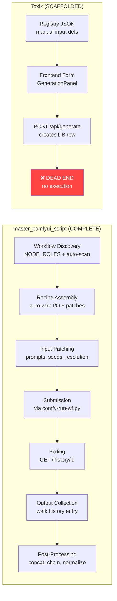
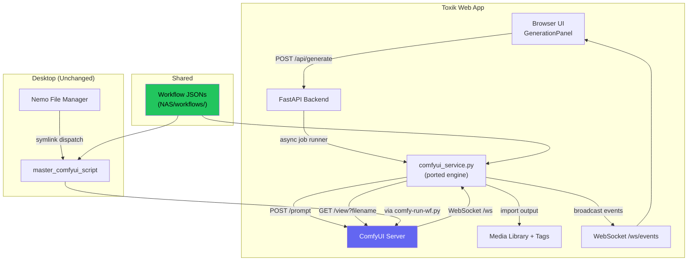

# ComfyUI Integration Analysis: `master_comfyui_script` × Toxik

## The Situation at a Glance



**TL;DR:** Toxik has a polished frontend and job queue schema but **zero ComfyUI execution logic**. `master_comfyui_script` has a battle-tested execution pipeline but is wired for desktop (Nemo + YAD). The integration opportunity is enormous — the script's core engine is exactly what Toxik needs.

---

## What `master_comfyui_script` Brings to the Table

| Capability | How It Works | Value to Toxik |
|---|---|---|
| **Auto-discovery** | `NODE_ROLES` dict + `find_node()` scans any ComfyUI API JSON for input/output/sampler/prompt/seed nodes | Eliminates manual `inputs` definitions in `registry.json` — drop a JSON, it just works |
| **Generic recipe builder** | `_generic_recipe()` auto-wires patches based on discovered nodes | Any workflow runs without custom code |
| **Input patching** | `apply_patches()` deep-copies JSON, maps source keys → node fields | Clean separation of "what to patch" from "how to patch" |
| **Sampler introspection** | `SAMPLER_DEFS` surfaces Steps/CFG/Denoise/Shift per sampler type | Dynamic form fields without manual definition |
| **Resolution detection** | Finds `ResolutionByOrientation` and `ImageScaleToTotalPixels` nodes | Resolution controls appear automatically |
| **Prompt extraction** | Reads embedded prompts from PNG tEXt chunks and video ffprobe tags | "From Media" re-prompting in the web UI |
| **Chaining** | Sequential iterations where output feeds next input, with break conditions | Powerful iterative generation (video extension, style refinement) |
| **Normalization** | Color/sharpness correction between chain iterations | Production-quality chain output |
| **Output collection** | `collect_outputs()` walks history entries recursively | Reliable output file discovery |

---

## What Toxik Already Has

| Component | Status | Notes |
|---|---|---|
| [registry.json](file:///home/coding/git/toxik/workflows/registry.json) | ✅ Working | Manual workflow metadata — will evolve to auto-generated |
| [generate.py](file:///home/coding/git/toxik/backend/routers/generate.py) | ⚠️ Partial | Creates DB jobs, but never executes them |
| [generation-panel.js](file:///home/coding/git/toxik/frontend/src/components/generation-panel.js) | ✅ Working | Slide-out panel with workflow selector, dynamic form, job queue |
| [database.py](file:///home/coding/git/toxik/backend/models/database.py) | ✅ Working | `generation_jobs` table with status/progress/comfyui_id/output_ids |
| [websocket.py](file:///home/coding/git/toxik/backend/routers/websocket.py) | ✅ Working | WebSocket event broadcast — just needs `job_*` events |
| [config.py](file:///home/coding/git/toxik/backend/config.py) | ⚠️ Missing | No ComfyUI host/port settings |

---

## Integration Strategy

> [!IMPORTANT]
> The core insight: **port the discovery/patching/polling engine, don't shell out to the script.** The script's YAD dialog, Nemo file manager integration, symlink dispatch, and process forking are all desktop concerns. The *engine* underneath is pure Python data manipulation that maps cleanly to an async web service.

### Phase 1 — Core Engine Port (`comfyui_service.py`)

Extract these functions directly from `master_comfyui_script` into a new [backend/services/comfyui_service.py](file:///home/coding/git/toxik/backend/services/comfyui_service.py):

```python
# FROM master_comfyui_script → Toxik backend
NODE_ROLES          # dict — copy verbatim
SAMPLER_DEFS        # list — copy verbatim
find_node()         # pure function, no dependencies
find_seed()         # pure function, no dependencies
discover_workflow() # loads JSON, scans nodes → WorkflowInfo
discover_form_fields() # builds dynamic form field list
_generic_recipe()   # auto-wires Recipe from WorkflowInfo
assemble()          # maps key → Recipe
apply_patches()     # deep-copy + patch nodes dict
collect_outputs()   # walks history entry for filenames
```

**What changes:**
- Replace `subprocess` calls to `comfy-run-wf.py` with **direct HTTP** `POST /prompt` to ComfyUI
- Replace synchronous `poll_for_completion()` with **async ComfyUI WebSocket** listener on `/ws` for real-time progress
- Replace file-based cache with the existing SQLite `generation_jobs` table
- Add output download: `GET /view?filename=...` from ComfyUI → save to Toxik media dir → auto-import

### Phase 2 — Config & Workflow Discovery

Update [config.py](file:///home/coding/git/toxik/backend/config.py):

```python
class Settings(BaseSettings):
    # ... existing ...
    comfyui_host: str = "localhost"
    comfyui_port: int = 9988
    comfyui_workflow_dir: Path | None = None  # if set, also scan this dir (e.g. NAS workflows)
```

New endpoint: `GET /api/workflows` evolves from static `registry.json` to **hybrid auto-discovery**:

1. Scan `workflows/` dir for `*.json` files
2. Run `discover_workflow()` on each → auto-detect inputs/outputs/samplers
3. Merge with `registry.json` metadata (display name, auto-tags, type label) where available
4. Return rich workflow descriptors with **auto-discovered form fields**

### Phase 3 — Background Job Runner

New async background task manager (launched at startup):

```python
async def job_runner():
    """Poll for queued jobs and execute them against ComfyUI."""
    while True:
        job = await get_next_queued_job(db)
        if job:
            await execute_job(job)  # discover → patch → submit → track → collect → import
        await asyncio.sleep(1)
```

Each job execution:
1. Load workflow JSON → `discover_workflow()`
2. `assemble()` → get `Recipe`
3. Merge user inputs into patch values
4. `apply_patches()` → patched nodes dict
5. `POST /prompt` to ComfyUI → get `prompt_id`
6. Connect to ComfyUI WebSocket `/ws` → stream progress events
7. On each progress event → update `generation_jobs.progress` + broadcast `job_progress` WebSocket event
8. On completion → `collect_outputs()` → download files → import to media library → auto-tag → broadcast `job_completed`

### Phase 4 — Frontend Dynamic Forms

Evolve [generation-panel.js](file:///home/coding/git/toxik/frontend/src/components/generation-panel.js) to render **auto-discovered form fields** instead of the current static `inputs` array:

| Script Field Type | Web UI Equivalent |
|---|---|
| `textarea` | `<textarea>` (prompts) |
| `string` | `<input type="text">` |
| `number` | `<input type="number">` with step |
| `combo` | `<select>` dropdown |
| `combo_number` | `<select>` with numeric options (resolution, length) |
| `checkbox` | Toggle switch |

This means **any workflow JSON dropped into the workflows dir** will automatically get a complete, correctly-typed parameter form in the web UI — exactly like the YAD dialog does today, but in the browser.

### Phase 5 — Advanced Features

| Feature | Approach |
|---|---|
| **Chaining** | Add `chain_count` field to job submission. Backend runs N sequential iterations, updating progress per step. |
| **Count (parallel seeds)** | Add `count` field. Backend submits N jobs with different random seeds. |
| **"From Media" prompt extraction** | New endpoint `GET /api/media/{id}/comfyui-prompt` using `extract_pos_prompt_from_media()` logic. Frontend adds a "📋 From Media" button. |
| **Queue direction** | Prepend/append toggle in UI → passed as flag to ComfyUI `/prompt` call |
| **Seed normalization** | Port normalization as optional post-processing step in the job runner |
| **Prompt inserts** | Load from `~/.comfyrc` or new DB-backed prompt snippets → quick-insert buttons in the web UI |
| **Multi-host** | ComfyUI host selector in the UI → maps to the `-via-<host>` concept |

---

## Shared Workflow Directory

> [!TIP]
> Point Toxik's `comfyui_workflow_dir` at the same directory `master_comfyui_script` uses (typically `~/git/nas/workflows`). Both tools then share the same workflow library — edit a workflow once, both tools see it.

```bash
# In .env or environment:
TOXIK_COMFYUI_WORKFLOW_DIR=/home/coding/git/nas/workflows
```

The script's explicit `assemble()` entries (`wan`, `vid-plus-audio`, etc.) become unnecessary in Toxik because `_generic_recipe()` handles everything. Those special cases only exist in the script for historical reasons — the generic path is strictly superior.

---

## Architecture After Integration



Both tools coexist, sharing the same workflow library and ComfyUI server. The web app gains the script's intelligence; the desktop script keeps working as-is.

---

## Implementation Order & Effort Estimates

| Phase | Files to Create/Modify | Effort | Dependency |
|---|---|---|---|
| **1. Core engine port** | New: `comfyui_service.py` (~400 lines) | Medium | None |
| **2. Config + discovery endpoint** | Mod: `config.py`, `generate.py` | Small | Phase 1 |
| **3. Background job runner** | New: `job_runner.py` (~200 lines), Mod: `main.py` | Medium | Phase 1+2 |
| **4. Dynamic frontend forms** | Mod: `generation-panel.js`, `client.js` | Medium | Phase 2 |
| **5. Advanced features** | Incremental additions | Large (but each is independent) | Phase 3+4 |

> [!NOTE]
> Phases 1–4 form the **MVP** — after those, Toxik can auto-discover any ComfyUI workflow, render its parameter form, execute it, track progress, collect outputs, and import them into the gallery with tags. Phase 5 features (chaining, normalization, multi-host) are gravy.

---

## Key Design Decisions to Make

1. **Direct HTTP vs. runner script?** — I recommend **direct HTTP** (`POST /prompt`) from the async backend. The external `comfy-run-wf.py` adds a subprocess layer that's unnecessary when you're already in Python with `aiohttp`.

2. **WebSocket vs. REST polling for progress?** — ComfyUI exposes a WebSocket at `/ws` that emits `progress`, `executing`, `execution_complete` events. For a web app, **WebSocket is clearly better** — lower latency, real-time progress bars, no polling overhead.

3. **Keep `registry.json` or pure auto-discovery?** — **Hybrid.** Auto-discovery handles form fields and I/O types. `registry.json` (or a future DB table) adds human-friendly names, type labels (`T2I`, `I2V`), and auto-tags. If a workflow has no registry entry, it still works with defaults.

4. **Output file handling?** — ComfyUI writes outputs to its own `output/` dir. Toxik should **download** them via ComfyUI's `/view` endpoint and copy them into Toxik's media dir, then import via the existing `media_service`. This keeps Toxik self-contained regardless of where ComfyUI runs.
